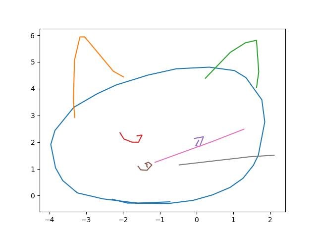

# Overview

Project for image2sketch.

Step 1: reimplement sketch-RNN model

## References

Main reference implementation (in tensorflow): https://github.com/tensorflow/magenta/tree/master/magenta/models/sketch_rnn

A helpful reference in pytorch: https://github.com/alexis-jacq/Pytorch-Sketch-RNN